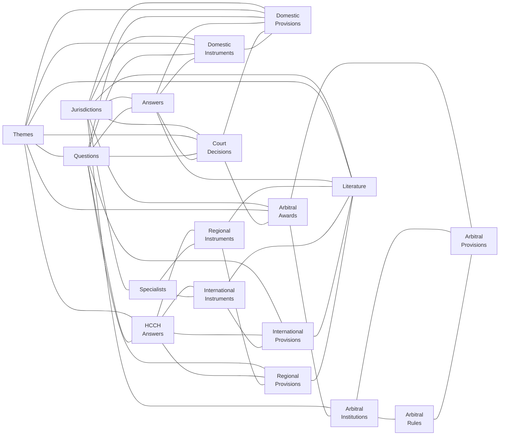
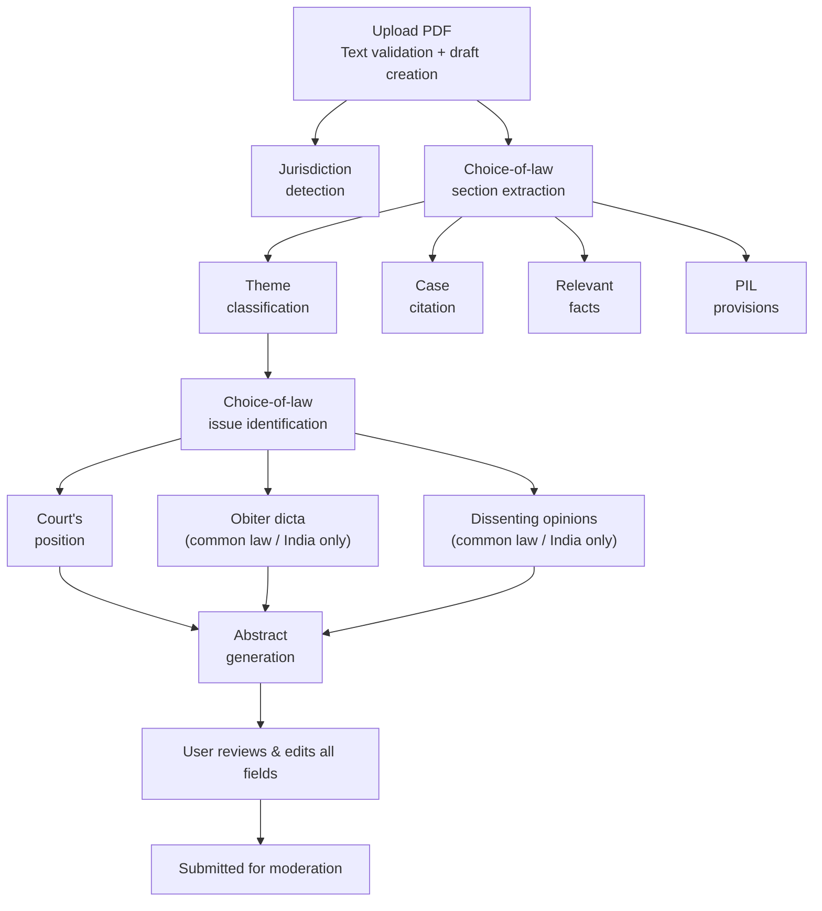

# CoLD Web App

Repository for the [Choice of Law Dataverse](https://cold.global) (CoLD) — an open-access knowledge base on choice of law in international contracts, developed at the University of Lucerne. Winner of the [Swiss National ORD Prize 2025](https://ord.swiss-academies.ch/news/swiss-national-ord-prize-2025-for-legal-and-environmental-sciences). Licensed under [CC BY 4.0](https://creativecommons.org/licenses/by/4.0/).

> **For AI coding agents**: See [AGENTS.md](AGENTS.md) for agent-specific instructions.

## Key Features

### Connected Knowledge Network

Every record in CoLD is linked to related records across the Dataverse, forming a navigable knowledge network. The diagram below shows how all 17 datasets connect to each other:



When viewing any record — a court decision, a statute, a treaty, or a piece of literature — users see all directly connected records. Each link leads to that record's own page with its own connections. This design supports several research patterns:

- **Trace a provision's impact.** Start from a domestic provision (e.g., Swiss IPRG Art. 116) and find every court decision that interpreted it, every questionnaire answer that references it, and every piece of literature that analyzes it.
- **Compare across jurisdictions.** Browse a questionnaire question and see how different countries answered it, which instruments implement those answers, and which court decisions have tested the rules in practice.
- **Explore arbitration networks.** Start from an arbitral award and navigate to the institution that administered it, the rules that governed the proceedings, the specific provisions applied, and related court decisions.
- **Discover literature.** View a regional or international instrument and find all academic publications that discuss it, across jurisdictions and legal traditions.
- **Find experts.** Browse a jurisdiction and see which specialists cover it, what international and regional instruments are relevant, and what cases and instruments exist.

Every entity type connects to at least two others; most connect to four or more. The result is that researchers rarely hit dead ends — following any link opens a new set of connections to explore.

### Case Analyzer

The Case Analyzer feeds new court decisions into this knowledge network. A user uploads a PDF of a court decision, and the system guides them through a multi-stage workflow — from document ingestion to moderation-ready structured data.

#### How it works

**Stage 1 — Upload.** The system stores the PDF in blob storage, validates that text can be extracted, and returns a draft id. No LLM call yet — upload returns as soon as the file is persisted.

**Stage 2 — AI analysis.** The system streams structured extraction results over Server-Sent Events. Each extractor is an agent with content-anchored navigation tools (`search`, `read_section`, `read_window`, `list_headings`, `get_paragraph_containing`, `read_head`, `read_tail`) that pull only the passages it needs from the full decision — no inlined text per prompt. Jurisdiction detection runs in parallel with the choice-of-law section as the first stage; the rest fan out in a dependency-aware order:



The choice-of-law section uses a single jurisdiction-agnostic prompt so it can run before jurisdiction is known; the downstream prompts switch on the detected (or user-corrected) jurisdiction. Common-law and Indian decisions add obiter dicta and dissenting opinions; civil-law decisions skip those branches. Throughout the pipeline, all structured fields are emitted in English, with two source-language exceptions kept verbatim for reviewer fidelity: the extracted choice-of-law passages and the case citation.

**Stage 3 — Review and submission.** The user sees all extracted fields with confidence indicators and can edit any of them. The detected jurisdiction is also editable; changing it triggers a confirmation modal and a full re-run with the corrected value. Once satisfied, the user submits for moderation. A human moderator reviews every submission before it enters the Dataverse — the AI pre-populates, but humans decide what gets published.

Progress is saved continuously, so if the connection drops mid-analysis users can resume from where they left off. Past analyses are tracked in a personal dashboard with their status (draft, analyzing, completed, pending review, approved, or rejected).

Try it at [cold.global/court-decision/new](https://cold.global/court-decision/new).

## Quick Start

### Prerequisites

- **Node.js v20+** with pnpm 10+
- **Python 3.12** (managed by uv)
- **uv** (Python package manager): `brew install uv` (macOS) or see [uv docs](https://docs.astral.sh/uv/)

### Running Locally

```bash
# Frontend (in one terminal)
cd frontend
pnpm install
pnpm run dev
# Open http://localhost:3000/

# Backend (in another terminal)
cd backend
make setup
make dev
# API docs at http://localhost:8000/api/v1/docs
```

## Development Workflow

### Before Committing

Always run validation checks before committing:

```bash
# Frontend validation
cd frontend && pnpm run check

# Backend validation
cd backend && make check
```

### Code Standards

- **Conventional Commits**: `type(scope): description` — types: `feat`, `fix`, `docs`, `style`, `refactor`, `test`, `chore`
- **No Barrel Files**: Avoid `index.ts`/`index.js`/`__init__.py` re-exports
- **TypeScript Only**: All frontend code must be `.ts` or `.vue` (never `.js`)

See [AGENTS.md](AGENTS.md) for detailed coding conventions.

## Project Structure

- **[frontend/](frontend/)**: Nuxt 4 application — see [frontend/README.md](frontend/README.md)
- **[backend/](backend/)**: FastAPI application — see [backend/README.md](backend/README.md)
- **[AGENTS.md](AGENTS.md)**: Instructions for AI coding agents

## API Documentation

The public API serves 17 datasets (court decisions, instruments, literature, arbitral awards, and more) across 63+ jurisdictions. Read-only data endpoints are publicly accessible — no API key required.

- **Production**: [api.cold.global/api/v1/docs](https://api.cold.global/api/v1/docs)
- **Local**: [localhost:8000/api/v1/docs](http://localhost:8000/api/v1/docs)
- **Bulk exports**: [cold.global/data-sets](https://cold.global/data-sets) (CSV and XLSX)

## Further Resources

- **[Tech Wiki](https://choice-of-law-dataverse.github.io/)** — architecture documentation and technical decisions
- **[Glossary](https://cold.global/learn/glossary)** — private international law terms used across the platform
- **[Methodology](https://cold.global/learn/methodology)** — how the CoLD questionnaire is structured and data is collected

## Versioning and Deployment Policy

We continuously deploy the backend and frontend independently. Each component evolves at its own pace, with versioning applied as changes are introduced.

When creating an official release, we align the version numbers of the backend and frontend to the highest version between the two, ensuring consistency.

## Language Style Guide

For website and data input:

- Language: `en-US` — English as used in the United States
- Use the [Oxford comma](https://en.wikipedia.org/wiki/Serial_comma)
- Apply "Bluebook" title case style for titles, convert titles [here](https://titlecaseconverter.com/)
- When in doubt, look to [George](https://en.wikipedia.org/wiki/Politics_and_the_English_Language#Remedy_of_Six_Rules)

Legal terminology:

- non-State law
