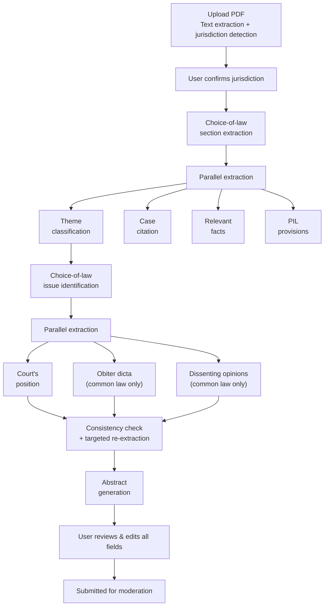
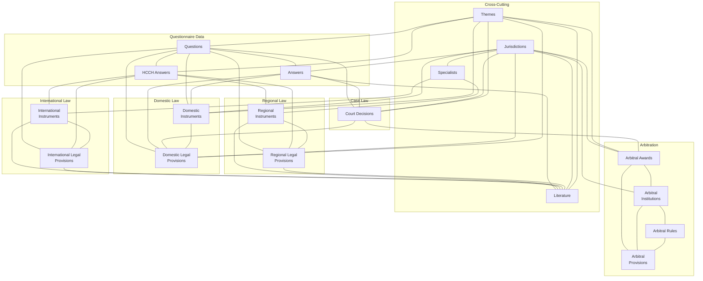

# CoLD Web App

Repository for the [Choice of Law Dataverse](https://cold.global) (CoLD) — an open-access knowledge base on choice of law in international contracts, developed at the University of Lucerne. Winner of the [Swiss National ORD Prize 2025](https://ord.swiss-academies.ch/news/swiss-national-ord-prize-2025-for-legal-and-environmental-sciences). Licensed under [CC BY 4.0](https://creativecommons.org/licenses/by/4.0/).

> **For AI coding agents**: See [AGENTS.md](AGENTS.md) for agent-specific instructions.

## Key Features

### Case Analyzer

CoLD includes an AI-powered tool that lets anyone contribute court decisions to the Dataverse. A user uploads a PDF of a court decision, and the system guides them through a multi-stage workflow — from document ingestion to moderation-ready structured data.

#### How it works

**Stage 1 — Upload and jurisdiction detection.** The system reads the PDF, extracts the text, and identifies which country's court issued the decision. The user confirms or corrects the detected jurisdiction before proceeding.

**Stage 2 — AI analysis.** The system runs 10 extraction steps in a dependency-aware order. Some steps run in parallel where they can; others must wait for earlier results:



The first extraction — identifying the choice-of-law sections within the decision — is the foundation. Once that completes, four fields are extracted simultaneously: the legal themes, case citation, relevant facts, and PIL provisions. The choice-of-law issue is then identified using the themes as context. From there, the court's position is extracted in parallel with obiter dicta and dissenting opinions (these two only appear for common-law jurisdictions and India).

**Stage 3 — Consistency check.** After all fields are extracted, the system cross-checks them against each other: Do the themes match the choice-of-law issue? Are the facts actually relevant? Do the provisions relate to the identified themes? If inconsistencies are found, the affected fields are re-extracted with corrective guidance.

**Stage 4 — Review and submission.** The user sees all extracted fields with confidence indicators and can edit any of them. Once satisfied, they submit for moderation. A human moderator reviews every submission before it enters the Dataverse — the AI pre-populates, but humans decide what gets published.

Progress is saved continuously, so if the connection drops mid-analysis, users can resume from where they left off. Past analyses are tracked in a personal dashboard with their status (draft, analyzing, completed, pending review, approved, or rejected).

Try it at [cold.global/court-decision/new](https://cold.global/court-decision/new).

### Connected Knowledge Network

Every record in CoLD is linked to related records across the Dataverse, forming a navigable knowledge network. The diagram below shows how all 17 datasets connect to each other:



When viewing any record — a court decision, a statute, a treaty, or a piece of literature — users see all directly connected records. Each link leads to that record's own page with its own connections. This design supports several research patterns:

- **Trace a provision's impact.** Start from a domestic provision (e.g., Swiss IPRG Art. 116) and find every court decision that interpreted it, every questionnaire answer that references it, and every piece of literature that analyzes it.
- **Compare across jurisdictions.** Browse a questionnaire question and see how different countries answered it, which instruments implement those answers, and which court decisions have tested the rules in practice.
- **Explore arbitration networks.** Start from an arbitral award and navigate to the institution that administered it, the rules that governed the proceedings, the specific provisions applied, and related court decisions.
- **Discover literature.** View a regional or international instrument and find all academic publications that discuss it, across jurisdictions and legal traditions.
- **Find experts.** Browse a jurisdiction and see which specialists cover it, what international and regional instruments are relevant, and what cases and instruments exist.

Every entity type connects to at least two others; most connect to four or more. The result is that researchers rarely hit dead ends — following any link opens a new set of connections to explore.

## Quick Start

### Prerequisites

- **Node.js v20+** with pnpm 10+
- **Python 3.12** (managed by uv)
- **uv** (Python package manager): `brew install uv` (macOS) or see [uv docs](https://docs.astral.sh/uv/)

### Running Locally

```bash
# Frontend (in one terminal)
cd frontend
pnpm install
pnpm run dev
# Open http://localhost:3000/

# Backend (in another terminal)
cd backend
make setup
make dev
# API docs at http://localhost:8000/api/v1/docs
```

## Development Workflow

### Before Committing

Always run validation checks before committing:

```bash
# Frontend validation
cd frontend && pnpm run check

# Backend validation
cd backend && make check
```

### Code Standards

- **Conventional Commits**: `type(scope): description` — types: `feat`, `fix`, `docs`, `style`, `refactor`, `test`, `chore`
- **No Barrel Files**: Avoid `index.ts`/`index.js`/`__init__.py` re-exports
- **TypeScript Only**: All frontend code must be `.ts` or `.vue` (never `.js`)

See [AGENTS.md](AGENTS.md) for detailed coding conventions.

## Project Structure

- **[frontend/](frontend/)**: Nuxt 4 application — see [frontend/README.md](frontend/README.md)
- **[backend/](backend/)**: FastAPI application — see [backend/README.md](backend/README.md)
- **[AGENTS.md](AGENTS.md)**: Instructions for AI coding agents

## API Documentation

The public API serves 17 datasets (court decisions, instruments, literature, arbitral awards, and more) across 63+ jurisdictions. Read-only data endpoints are publicly accessible — no API key required.

- **Production**: [api.cold.global/api/v1/docs](https://api.cold.global/api/v1/docs)
- **Local**: [localhost:8000/api/v1/docs](http://localhost:8000/api/v1/docs)
- **Bulk exports**: [cold.global/data-sets](https://cold.global/data-sets) (CSV and XLSX)

## Further Resources

- **[Tech Wiki](https://choice-of-law-dataverse.github.io/)** — architecture documentation and technical decisions
- **[Glossary](https://cold.global/learn/glossary)** — private international law terms used across the platform
- **[Methodology](https://cold.global/learn/methodology)** — how the CoLD questionnaire is structured and data is collected

## Versioning and Deployment Policy

We continuously deploy the backend and frontend independently. Each component evolves at its own pace, with versioning applied as changes are introduced.

When creating an official release, we align the version numbers of the backend and frontend to the highest version between the two, ensuring consistency.

## Language Style Guide

For website and data input:

- Language: `en-US` — English as used in the United States
- Use the [Oxford comma](https://en.wikipedia.org/wiki/Serial_comma)
- Apply "Bluebook" title case style for titles, convert titles [here](https://titlecaseconverter.com/)
- When in doubt, look to [George](https://en.wikipedia.org/wiki/Politics_and_the_English_Language#Remedy_of_Six_Rules)

Legal terminology:

- non-State law
