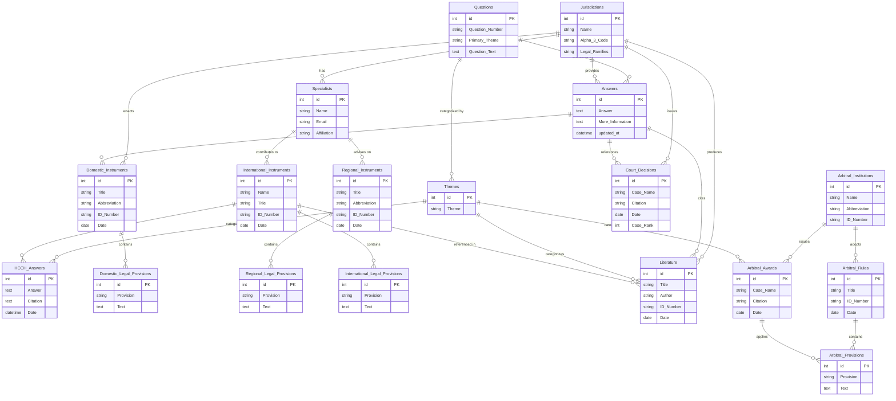
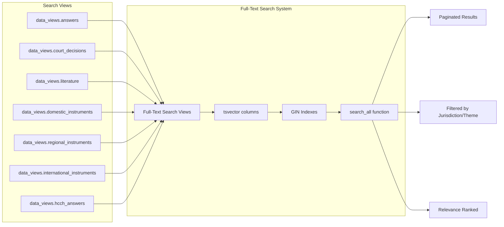
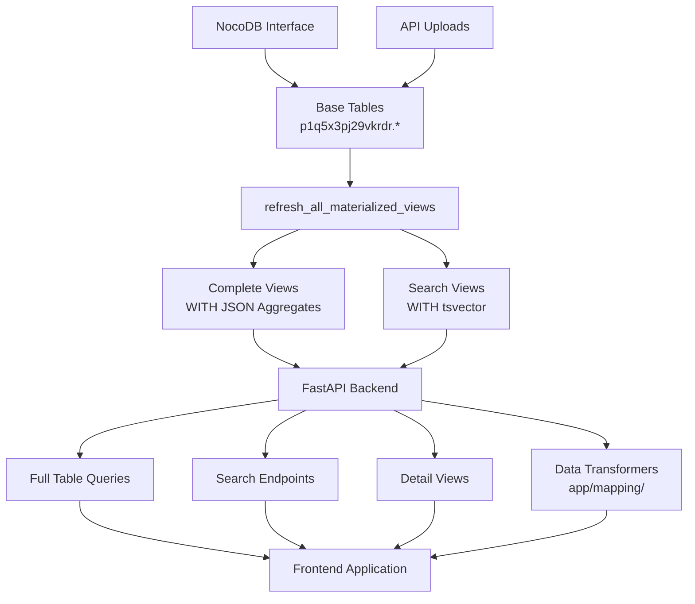

# CoLD Database SQL Documentation

This directory contains the SQL setup and schema for the Choice of Law Dataverse (CoLD) database. The database uses PostgreSQL with a complex structure of base tables, junction tables for many-to-many relationships, and materialized views for optimized data retrieval.

## Database Architecture Overview

The database is organized into two main schemas:
- **`p1q5x3pj29vkrdr`** - Contains base tables and junction tables (NocoDB schema)
- **`data_views`** - Contains materialized views for optimized queries and search functionality

## Entity Relationship Diagram

This diagram shows the core entities and their relationships in the CoLD database:



## Materialized Views Architecture

The database uses materialized views to provide optimized, pre-computed data sets. There are two types of materialized views:

### Complete Views (`*_complete`)
These views include full records with all related data as JSON aggregates:

```mermaid
graph TD
    %% Base Tables
    BT[Base Tables<br/>p1q5x3pj29vkrdr.*] --> CV[Complete Views<br/>data_views.*_complete]
    JT[Junction Tables<br/>_nc_m2m_*] --> CV
    
    %% Complete Views
    CV --> QC[questions_complete]
    CV --> AC[answers_complete]
    CV --> HAC[hcch_answers_complete]
    CV --> DIC[domestic_instruments_complete]
    CV --> DLPC[domestic_legal_provisions_complete]
    CV --> RIC[regional_instruments_complete]
    CV --> RLPC[regional_legal_provisions_complete]
    CV --> IIC[international_instruments_complete]
    CV --> ILPC[international_legal_provisions_complete]
    CV --> CDC[court_decisions_complete]
    CV --> LC[literature_complete]
    CV --> AAC[arbitral_awards_complete]
    CV --> AINC[arbitral_institutions_complete]
    CV --> ARC[arbitral_rules_complete]
    CV --> APC[arbitral_provisions_complete]
    CV --> JC[jurisdictions_complete]
    
    %% Search Views
    CV --> SV[Search Views<br/>data_views.* (without _complete)]
    SV --> AS[answers]
    SV --> HAS[hcch_answers]
    SV --> CDS[court_decisions]
    SV --> DIS[domestic_instruments]
    SV --> RIS[regional_instruments]
    SV --> IIS[international_instruments]
    SV --> LS[literature]
    
    %% Search Function
    SV --> SF[search_all function]
    SF --> API[FastAPI Search Endpoints]
```

### Search Views (without `_complete`)
These views are optimized for full-text search with tsvector columns:



## Data Flow and Transformation Pipeline



## Key Features

### 1. **Comprehensive Data Model**
- **18 base tables** covering all aspects of choice of law data
- **32 junction tables** for many-to-many relationships
- **23 materialized views** for optimized queries

### 2. **Advanced Search Capabilities**
- Full-text search across all entity types
- Jurisdiction and theme filtering
- Relevance ranking with custom business rules
- Pagination and sorting

### 3. **Data Integrity**
- Unique indexes on all materialized views
- Concurrent refresh capability for high-availability
- Automatic refresh function for all views

### 4. **Performance Optimization**
- Pre-computed JSON aggregates in complete views
- GIN indexes on tsvector columns for fast text search
- Materialized views reduce complex join overhead

## Refresh Strategy

The materialized views are refreshed using the `data_views.refresh_all_materialized_views()` function:

```sql
-- Manual refresh of all views
SELECT data_views.refresh_all_materialized_views();
```

This function:
- Detects views with unique indexes for concurrent refresh
- Falls back to non-concurrent refresh when needed
- Provides logging for monitoring refresh operations

## Files in this Directory

- **`setup.sql`** - Main database schema and materialized view definitions
- **`nocodb_schema.sql`** - Query for exploring NocoDB table structure
- **`fts-with-filters.sql`** - Full-text search with filtering examples
- **`hop-1-graph.sql`** - Graph queries for relationship analysis
- **`cron_job.sql`** - Scheduled maintenance operations

## Development Guidelines

1. **Adding New Views**: Follow the naming convention `data_views.{entity}_complete` for complete views and `data_views.{entity}` for search views
2. **Indexing**: Always add unique indexes to materialized views to enable concurrent refresh
3. **Search Integration**: Include tsvector columns in search views for full-text search capability
4. **Testing**: Use the backend test suite to validate view functionality after changes

For more details on the data transformation system, see the backend documentation in `backend/app/mapping/`.